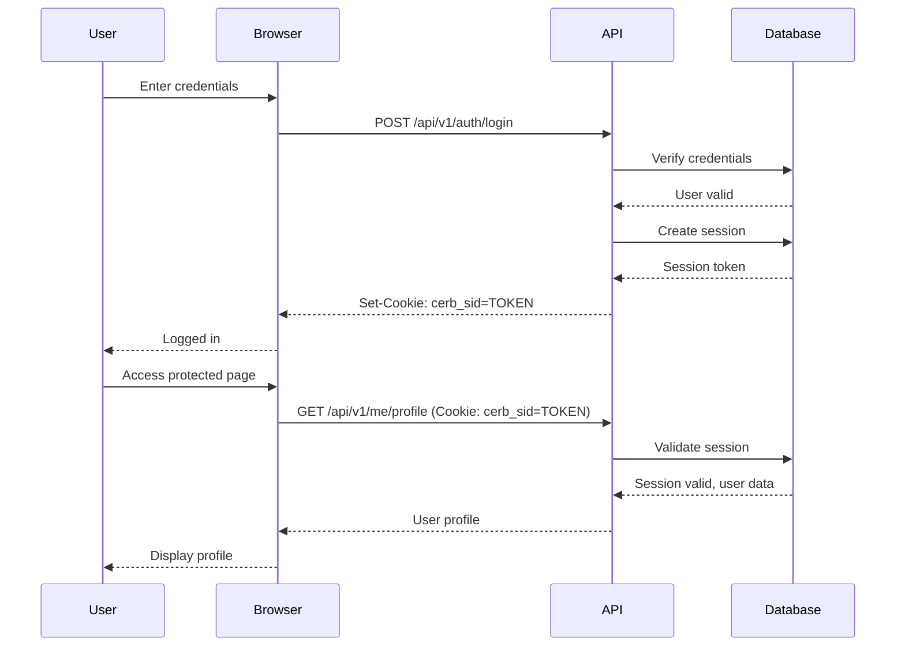

# Session Management

Learn how Cerberus IAM manages user sessions for web applications.

## Overview

Cerberus IAM provides **session-based authentication** for web applications using secure, httpOnly cookies. Sessions are stored in the database and validated on each request.

## How Sessions Work

### Session Lifecycle



### Session Creation

When a user logs in successfully:

1. Server generates a cryptographically secure random session token
2. Session record is created in database with:
   - `sessionToken` (unique, indexed)
   - `userId` and `organisationId`
   - `expiresAt` timestamp
   - `lastActivityAt` timestamp
   - `ipAddress` and `userAgent` for audit
3. httpOnly cookie is set in response
4. User is authenticated for subsequent requests

### Session Validation

On each authenticated request:

1. Cookie is extracted from request headers
2. Session is queried from database by token
3. Checks performed:
   - Session exists and not expired
   - User exists, not deleted, not blocked
   - Session belongs to correct organization
4. If valid, `req.user` and `req.authOrganisation` are set
5. `lastActivityAt` is updated for idle timeout tracking

## Configuration

### Environment Variables

```env
# Cookie name (default: cerb_sid)
SESSION_COOKIE_NAME=cerb_sid

# HTTPS only (set true in production)
SESSION_COOKIE_SECURE=false

# Cookie domain (.example.com for subdomains)
SESSION_COOKIE_DOMAIN=localhost

# SameSite attribute (lax, strict, none)
SESSION_COOKIE_SAMESITE=lax
```

### Organization Settings

Per-organization session policies:

```typescript
{
  sessionLifetime: 86400,        // 24 hours (seconds)
  sessionIdleTimeout: 3600       // 1 hour (seconds)
}
```

Update via Admin API:

```bash
curl -X PATCH https://auth.example.com/api/v1/admin/organisation \
  -H "Content-Type: application/json" \
  -H "X-Org-Slug: acme-corp" \
  -H "Cookie: cerb_sid=..." \
  -d '{
    "sessionLifetime": 43200,
    "sessionIdleTimeout": 1800
  }'
```

## Session Security

### httpOnly Cookies

Sessions use httpOnly cookies to prevent JavaScript access:

```http
Set-Cookie: cerb_sid=abc123; HttpOnly; Secure; SameSite=Lax; Path=/; Max-Age=86400
```

**Attributes:**

- `HttpOnly` - Prevents JavaScript access (XSS protection)
- `Secure` - HTTPS only (production)
- `SameSite=Lax` - CSRF protection
- `Path=/` - Available for all routes
- `Max-Age` - Cookie expiration

### CSRF Protection

Session-based requests require CSRF token validation for state-changing operations (POST, PUT, PATCH, DELETE).

**CSRF Flow:**

1. Server generates CSRF token on GET requests
2. Token returned in `X-CSRF-Token` header and `res.locals.csrfToken`
3. Client includes token in subsequent POST/PUT/PATCH/DELETE requests
4. Server validates token matches session

**Example:**

```javascript
// Get CSRF token
const response = await fetch('https://api.example.com/api/v1/me/profile', {
  credentials: 'include',
});
const csrfToken = response.headers.get('X-CSRF-Token');

// Use token in POST request
await fetch('https://api.example.com/api/v1/me/profile', {
  method: 'PATCH',
  credentials: 'include',
  headers: {
    'Content-Type': 'application/json',
    'X-CSRF-Token': csrfToken,
  },
  body: JSON.stringify({ firstName: 'John' }),
});
```

### Session Fixation Protection

Sessions are regenerated on:

- Login (new session created)
- Privilege escalation (MFA verification)

Old session tokens are invalidated.

### IP and User Agent Tracking

Sessions record:

- `ipAddress` - Client IP address
- `userAgent` - Browser user agent string
- `lastActivityAt` - Last request timestamp

This enables:

- Anomaly detection (IP changes)
- Audit trail
- Session management UI showing device info

## Managing Sessions

### List Active Sessions

**Endpoint:** `GET /api/v1/me/sessions`

```bash
curl https://auth.example.com/api/v1/me/sessions \
  -H "X-Org-Slug: acme-corp" \
  -H "Cookie: cerb_sid=..."
```

**Response:**

```json
{
  "sessions": [
    {
      "id": "session-uuid-1",
      "ipAddress": "192.168.1.100",
      "userAgent": "Mozilla/5.0 (Macintosh; Intel Mac OS X 10_15_7)...",
      "lastActivityAt": "2024-01-15T10:30:00Z",
      "expiresAt": "2024-01-16T10:00:00Z",
      "current": true
    },
    {
      "id": "session-uuid-2",
      "ipAddress": "192.168.1.101",
      "userAgent": "Mozilla/5.0 (iPhone; CPU iPhone OS 17_0...)...",
      "lastActivityAt": "2024-01-15T09:00:00Z",
      "expiresAt": "2024-01-16T09:00:00Z",
      "current": false
    }
  ]
}
```

### Revoke a Session

**Endpoint:** `DELETE /api/v1/me/sessions/:id`

```bash
curl -X DELETE https://auth.example.com/api/v1/me/sessions/session-uuid-2 \
  -H "X-Org-Slug: acme-corp" \
  -H "Cookie: cerb_sid=..." \
  -H "X-CSRF-Token: csrf-token-here"
```

This logs the user out from that specific device/browser.

### Logout (Current Session)

**Endpoint:** `POST /api/v1/auth/logout`

```bash
curl -X POST https://auth.example.com/api/v1/auth/logout \
  -H "X-Org-Slug: acme-corp" \
  -H "Cookie: cerb_sid=..." \
  -H "X-CSRF-Token: csrf-token-here"
```

Deletes the current session and clears the cookie.

### Logout All Sessions

To revoke all user sessions (e.g., password change, security breach):

```bash
# Admin API (future feature)
curl -X DELETE https://auth.example.com/api/v1/admin/users/:userId/sessions \
  -H "X-Org-Slug: acme-corp" \
  -H "Cookie: cerb_sid=..." \
  -H "X-CSRF-Token: csrf-token-here"
```

## Session Expiration

### Absolute Expiration

Sessions expire after `sessionLifetime` seconds from creation, regardless of activity.

**Default:** 24 hours (86400 seconds)

```typescript
expiresAt = createdAt + sessionLifetime;
```

### Idle Timeout

Sessions expire after `sessionIdleTimeout` seconds of inactivity.

**Default:** 1 hour (3600 seconds)

```typescript
if (now - lastActivityAt > sessionIdleTimeout) {
  // Session expired
}
```

### Cleanup

Expired sessions are automatically cleaned up by a background job:

```typescript
// Delete sessions where expiresAt < now
await prisma.session.deleteMany({
  where: {
    expiresAt: { lt: new Date() },
  },
});
```

## Client Implementation

### React Example

```typescript
import { useState, useEffect } from 'react';

interface Session {
  id: string;
  ipAddress: string;
  userAgent: string;
  lastActivityAt: string;
  expiresAt: string;
  current: boolean;
}

export function SessionManager() {
  const [sessions, setSessions] = useState<Session[]>([]);
  const [loading, setLoading] = useState(true);

  useEffect(() => {
    fetchSessions();
  }, []);

  async function fetchSessions() {
    const response = await fetch('/api/v1/me/sessions', {
      credentials: 'include',
      headers: {
        'X-Org-Slug': 'acme-corp'
      }
    });

    const data = await response.json();
    setSessions(data.sessions);
    setLoading(false);
  }

  async function revokeSession(sessionId: string) {
    // Get CSRF token
    const csrfToken = await getCSRFToken();

    await fetch(`/api/v1/me/sessions/${sessionId}`, {
      method: 'DELETE',
      credentials: 'include',
      headers: {
        'X-Org-Slug': 'acme-corp',
        'X-CSRF-Token': csrfToken
      }
    });

    // Refresh list
    await fetchSessions();
  }

  if (loading) return <div>Loading...</div>;

  return (
    <div>
      <h2>Active Sessions</h2>
      {sessions.map(session => (
        <div key={session.id} className="session-card">
          <div>
            <strong>{session.current ? 'This device' : 'Other device'}</strong>
            <p>IP: {session.ipAddress}</p>
            <p>Last active: {new Date(session.lastActivityAt).toLocaleString()}</p>
            <p>Expires: {new Date(session.expiresAt).toLocaleString()}</p>
          </div>
          {!session.current && (
            <button onClick={() => revokeSession(session.id)}>
              Revoke
            </button>
          )}
        </div>
      ))}
    </div>
  );
}

async function getCSRFToken(): Promise<string> {
  const response = await fetch('/api/v1/me/profile', {
    credentials: 'include',
    headers: { 'X-Org-Slug': 'acme-corp' }
  });
  return response.headers.get('X-CSRF-Token') || '';
}
```

## Multi-Tenant Sessions

Sessions are organization-scoped. The `X-Org-Slug` header determines which organization the session belongs to.

### Tenant Middleware

The tenant middleware runs before authentication:

```typescript
// 1. Extract X-Org-Slug header
const slug = req.headers['x-org-slug'];

// 2. Lookup organization
const org = await prisma.organisation.findUnique({ where: { slug } });

// 3. Set on request
req.tenant = { id: org.id, slug, organisation: org };
```

### Session Validation

Session authentication validates organization match:

```typescript
// Ensure session belongs to requested organization
if (session.organisationId !== req.tenant.id) {
  // Invalid - session for different org
  res.clearCookie('cerb_sid');
  return sendProblem(res, unauthorized());
}
```

## Best Practices

### Production Configuration

```env
NODE_ENV=production
SESSION_COOKIE_SECURE=true
SESSION_COOKIE_DOMAIN=.yourdomain.com
SESSION_COOKIE_SAMESITE=strict
```

### Session Duration

Balance security and user experience:

- **High security**: 1-4 hours absolute, 15-30 minutes idle
- **Standard**: 24 hours absolute, 1 hour idle
- **Convenience**: 7 days absolute, 24 hours idle

### HTTPS Only

Always use HTTPS in production:

```env
SESSION_COOKIE_SECURE=true
```

Without HTTPS, session cookies can be intercepted.

### Monitoring

Track session metrics:

- Active sessions per user
- Session creation rate
- Session expiration rate
- Failed validation attempts

### Anomaly Detection

Alert on suspicious patterns:

- Session used from multiple IPs simultaneously
- Rapid session creation
- Geographic impossibility (user in US, then China 1 minute later)

## Troubleshooting

### Session not persisting

**Cause:** Cookie not being sent or received

**Solutions:**

1. Ensure `credentials: 'include'` in fetch requests
2. Check CORS allows credentials
3. Verify cookie domain matches request domain
4. Check browser blocks third-party cookies

### CSRF token invalid

**Cause:** Token mismatch or missing

**Solutions:**

1. Fetch token from response header or page
2. Include `X-CSRF-Token` header in POST/PUT/PATCH/DELETE requests
3. Ensure token from same session

### Session expired quickly

**Cause:** Idle timeout too short

**Solution:** Adjust `sessionIdleTimeout`:

```typescript
await updateOrganisation({
  sessionIdleTimeout: 7200, // 2 hours
});
```

### Can't logout

**Cause:** CSRF validation failing or session already invalid

**Solutions:**

1. Ensure CSRF token is valid
2. Check session still exists
3. Verify organization slug matches

## Next Steps

- [Authentication Guide](/guide/authentication) - Authentication flows
- [CSRF Protection](/architecture/security#csrf-protection) - Security architecture
- [API Reference](/api/me/sessions) - Session API documentation
- [OAuth2 Guide](/guide/oauth2) - Token-based authentication alternative
